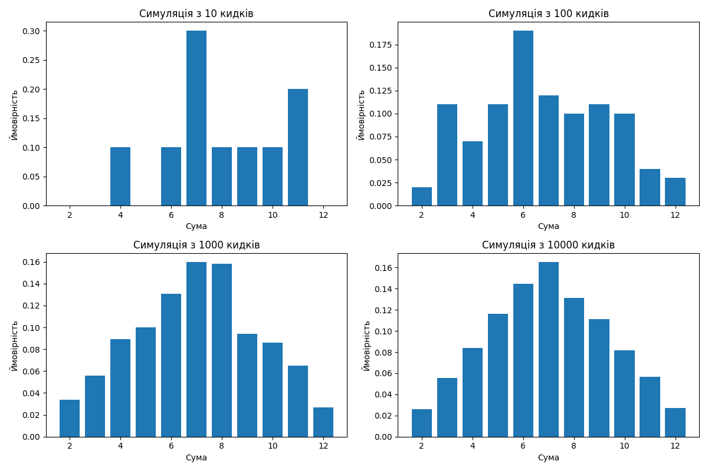

# Порівняння отриманих за допомогою методу Монте-Карло результати з аналітичними розрахунками.
В результаті агрегації результатів випадкових кидків кубіків в різних кількостях отриманні наступні розподіли вірогідності отриманнярізних сум комбінацій кубіків:

Наведені дані показують близький до нормального розподіл при кількості кидків більш за 1000.

При цьому похибка в порівнянні з теоретичними розрахунками згідно таблиці

| sums 	| probability 	| difference 	|
|------	|-------------	|------------	|
| 2    	| 2.764       	| 0.02       	|
| 3    	| 5.641       	| 0.08       	|
| 4    	| 8.140       	| 0.19       	|
| 5    	| 11.271      	| 0.16       	|
| 6    	| 13.782      	| 0.11       	|
| 7    	| 16.711      	| 0.04       	|
| 8    	| 13.693      	| 0.20       	|
| 9    	| 11.186      	| 0.08       	|
| 10   	| 8.357       	| 0.03       	|
| 11   	| 5.577       	| 0.02       	|
| 12   	| 2.878       	| 0.10       	|

не перевищую 0,2%. 

Надані результати дозволяють стверджувати, що результати, отриманні методом Монте-Карло є дуже близькими до теоретичних при нормальному розподілі на великих кількостях кидків (більш за 1000).