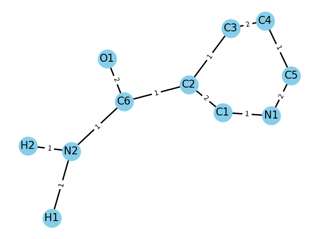

# Порівняльний аналіз алгоритмів пошуку DFS та BFS в графі на прикладі молекули никотинамиду

### Cтруктура молекули никотинамида засобами візуалізації грвфів пакету NetworkX.

Розглянемо шляхи, які пройшли відповідні алгоритми від атому кисню:
### DFS: O1 C6 N2 H2 H1 C2 C3 C4 C5 N1 C1
### BFS: O1 C6 C2 N2 C1 C3 H1 H2 N1 C4 C5

Обидва алгоритму стартують з атомі кисню (О1) до С6.

BFS досліджує всіх сусідів С6 в альфа-положенні, тобто С2 та Т2, далі наступні атоми в бета-положенні (розділяє 2 послідних зв'язки) C1 C3 H1 H2, наступна група по віддаленості N1 C4 і найбільш віддалений від O1 атом це C5.

DFS з C6 вибрав спочатку короткий напрямок і повернув в напрямку N2, заглибився до H1 і тим сами дійшов дна цієї гілки і почав рекурсивно повертатися, розбираючи стек до N2, там занурився до H1 і знову дійшов кінця і почав повертатися по стеку назад, настпний в стеку був С2 - довгий напрямокю На розвилці С2 алгоритм вибрав напрямок С3 і далі лійнійно пройшов цикл С3 С4 С5 N1 C1.

З точки зору аналізу хімічної структури алгоритм BFS видає шлях розповсюдження і затухання впливу індуктивно ефекти обраного атому. DFS алгоритм дозволяє виявляти терминальні, просторово доступні атоми.